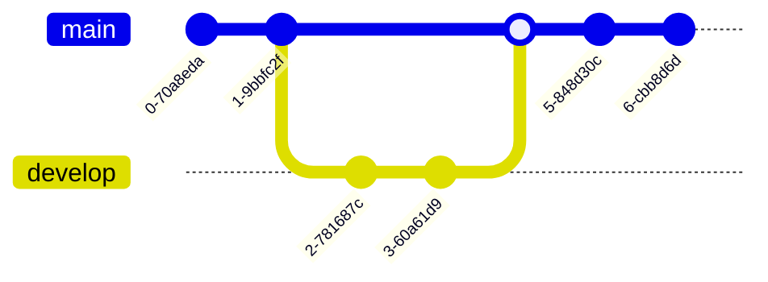

# 5.2 Visão de Desenvolvimento

A Visão de Desenvolvimento descreve como o sistema AcadMap está estruturado em termos de diretórios, pacotes e organização do código-fonte. O sistema é composto por dois grandes blocos tecnológicos:

* Backend monolítico com Java + Spring Boot
* Frontend com React + Vite

Ambas as partes são integradas via API REST e armazenam dados em um banco PostgreSQL, conforme representado na Visão Lógica.

## 5.2.1 Estrutura de Repositórios
O código e a documentação do sistema estão hospedados no GitHub:

1. [**Repositório de Desenvolvimento**](https://github.com/SainyGb/AcadMap-Docs)

2. [**Repositório de Documentação**](https://github.com/SainyGb/AcadMap-Docs)

Todos os repositórios seguem boas práticas de versionamento (`main`, `develop`), commits semânticos (conventional commits), e segue o Git Trunk Flow, com CI/CD configurado via GitHub Actions.

Cada repositório possui:

- Arquivo `README.md` com instruções de uso e contribuição
- Padrão de branches (`feature/*`, `fix/*`, `hotfix/*`)
- Pull Requests com revisão obrigatória

### Modelo de Estrutura de Arquivos
```
📁 .
├── 📁 backend
│   ├── 📄 Dockerfile
│   ├── 📁 src
│   │   └── 📁 main
│   │       ├── 📁 java
│   │       │   └── 📁 com
│   │       │       └── 📁 acadmap
│   │       │           ├── 📁 controller
│   │       │           ├── 📁 model
│   │       │           ├── 📁 repository
│   │       │           └── 📁 service
│   │       └── 📁 resources
│   └── 📁 tomcat
├── 📁 db
├── 📄 docker-compose.yml
├── 📄 .env
├── 📁 frontend
│   ├── 📄 Dockerfile
│   ├── 📁 public
│   └── 📁 src
│       ├── 📁 components
│       ├── 📁 pages
│       └── 📁 services
├── 📁 .github
│   └── 📁 workflows
│       └── 📄 ci.yml
└── 📄 README.md
```

## 5.2.2 Pipeline de CI/CD (RESUMO)


## 5.2.3 Gerência de Desenvolvimento e Tarefas

O projeto utiliza o recurso **GitHub Projects** para organização e acompanhamento das atividades de desenvolvimento, com os seguintes objetivos:

- Planejamento de entregas por sprint ou fase
- Priorização de funcionalidades e correções
- Acompanhamento do progresso por coluna (Kanban)
- Integração direta com Pull Requests e Issues

[Acesso o quadro aqui]()



---
