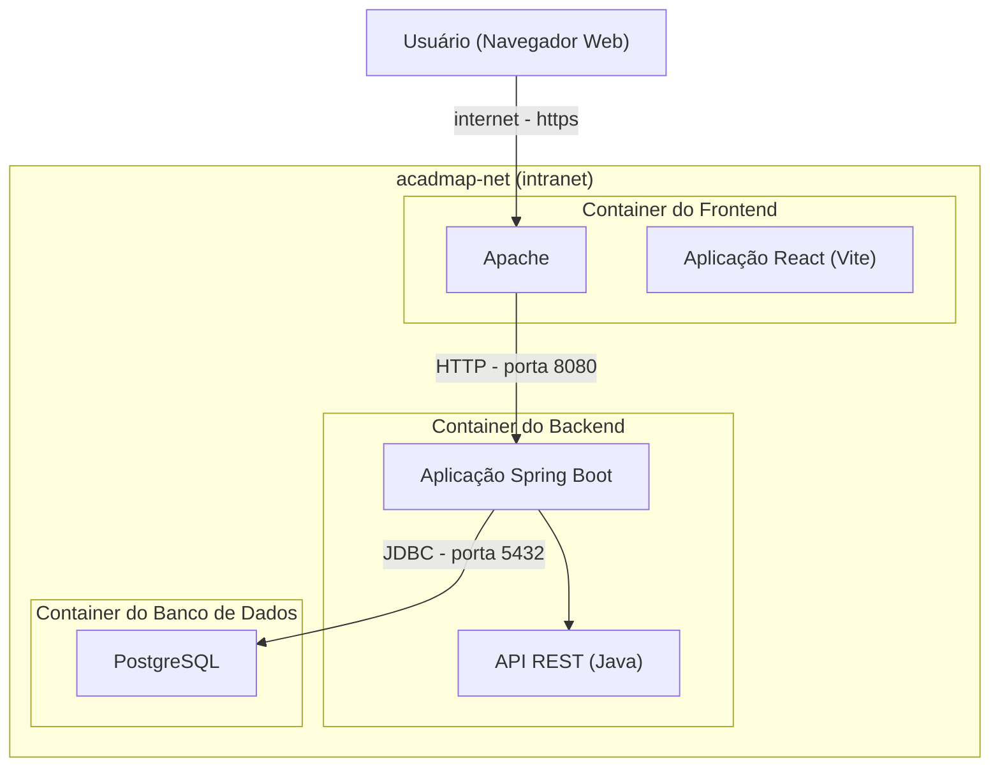

# Visão de Implantação

A Visão de Implantação descreve como o sistema AcadMap é fisicamente distribuído no ambiente de execução, com foco na infraestrutura de contêineres Docker. Essa visão é fundamental para compreender o ambiente operacional do sistema, incluindo a alocação de componentes, fluxos de comunicação, protocolos utilizados e fronteiras de segurança.

O diagrama a seguir apresenta uma visão de alto nível da implantação do sistema em um cenário típico de produção, com os seguintes elementos principais:

* Usuário final, que acessa o sistema por meio de um navegador web;
* Fronteira de rede, que separa o ambiente da internet pública da rede interna de containers;
* Container Apache HTTP Server, responsável por servir os arquivos estáticos do frontend (React + Vite);
* Container Backend (Spring Boot), que implementa a lógica de negócio e expõe as APIs REST em JSON;
* Container Banco de Dados (PostgreSQL), que armazena persistentemente os dados da aplicação;
* Toda a comunicação entre os containers ocorre dentro de uma rede Docker interna (bridge), utilizando protocolos padronizados como HTTPS, HTTP e JDBC.

Esse modelo garante isolamento entre serviços, facilita o escalonamento e simplifica o processo de implantação e manutenção por meio de orquestração baseada em contêineres.

## Diagrama de Implantação - DEP-01



Clique nos blocos abaixo para visualizar versões em outros formatos:

??? info "Versão PlantUML"
    ```plantuml
        @startuml
        title DEP-01 – Diagrama de Implantação do Sistema AcadMap   
        actor user as "Usuário"
        node browser as "Navegador Web"     
        ' Fronteira entre internet pública e rede interna Docker
        boundary "Fronteira de Rede\n(Pública > Interna)" as internet   
        ' Rede interna - Docker
        node "Rede Docker Interna (acadmap-net)" as docker_net {    
        node "Container Apache HTTP Server" as apache {
        port p_https
        artifact "Frontend (JS + React)" as front
        }   
        node "Container Backend Spring Boot" as backend {
        artifact "API REST (Java)" as api
        }   
        node "Container Banco de Dados" as db_container {
        database "PostgreSQL" as db
        }
        }   
        ' Ligações com a fronteira (com indicação clara do ponto de transição)
        user --> browser
        browser --> internet : HTTPS
        internet --> p_https    
        ' Conexões internas da rede Docker
        apache --> backend : HTTP (porta 8080)
        backend --> db : JDBC (porta 5432)
        @enduml
    ```

??? info "Versão .png"
    

O diagrama IMPL-01 mostra que o usuário interage com o sistema AcadMap por meio de um navegador, acessando o frontend hospedado em um servidor Apache via HTTPS. Esse frontend comunica-se com a API REST do backend via HTTP, que por sua vez realiza operações no banco de dados PostgreSQL utilizando JPA via JDBC.

A separação entre a Internet e a infraestrutura interna do sistema evidencia uma preocupação com segurança e organização da rede. O servidor de aplicação e o banco de dados são acessíveis apenas internamente, enquanto a interface pública é controlada pelo servidor web.

---
