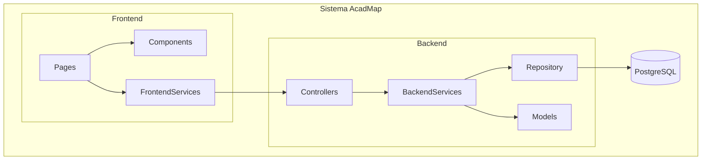
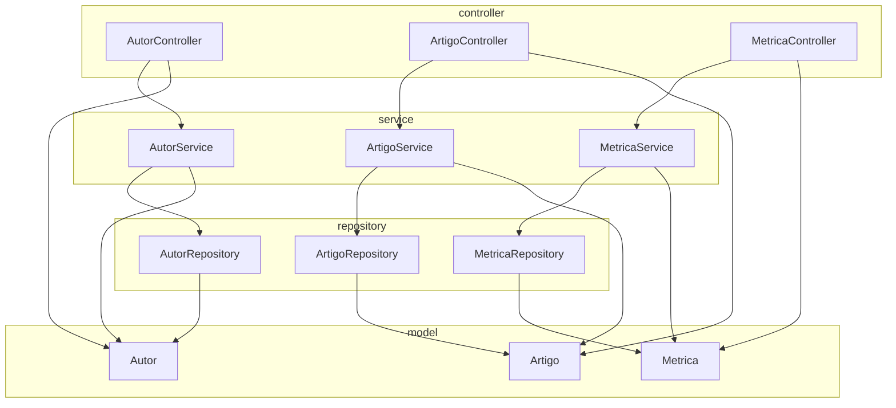
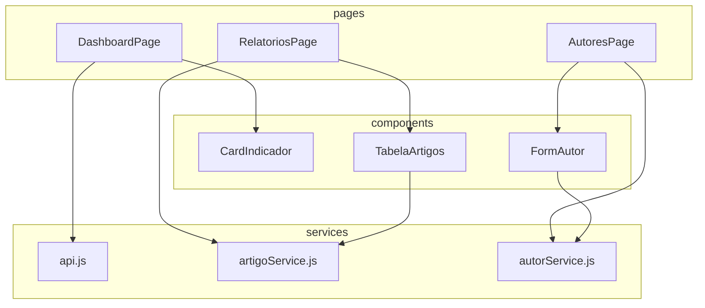

# 5.1 Visão Lógica

 

A Visão Lógica descreve a estrutura interna do sistema AcadMap, detalhando os principais pacotes, camadas e dependências entre os componentes de software. Esta visão está organizada em três blocos tecnológicos fundamentais: o frontend, desenvolvido com React e empacotado via Vite; o backend, implementado em Java utilizando o framework Spring Boot sob o padrão MVC (Model-View-Controller); e o banco de dados, estruturado em PostgreSQL.

Cada camada foi desenhada com foco em boas práticas de engenharia de software, promovendo a separação clara de responsabilidades, a reutilização de código, a legibilidade e a facilidade de manutenção. 

Os diagramas a seguir ilustram essas estruturas e seus relacionamentos internos e externos, permitindo uma visualização clara da organização lógica do sistema.

## 5.1.1 Visão Geral do Sistema

O acesso ao sistema se inicia no navegador do usuário, que interage com o frontend da aplicação via protocolo HTTPS. Esse frontend é uma aplicação desenvolvida em React e hospedada em um servidor web Apache, o qual está exposto à Internet. A camada de frontend é responsável por renderizar a interface do usuário e encaminhar as requisições para o backend.

As requisições de dados feitas pelo frontend são encaminhadas ao backend, uma aplicação Java Spring Boot, que atua como servidor de aplicação. A comunicação entre o frontend e o backend se dá via HTTP interno, utilizando uma API REST baseada em JSON.

O backend, por sua vez, realiza operações de leitura e escrita em um banco de dados PostgreSQL, hospedado em um servidor dedicado de banco de dados. Essa comunicação utiliza a especificação JPA (Java Persistence API), implementada com o JDBC, por meio da porta padrão 5432.

### Diagrama de Componentes de Alto Nível - COMP-GERAL-01


Clique nos blocos abaixo para visualizar versões em outros formatos:

??? info "Versão PlantUML"
    ```plantuml
    @startuml
    title COMP-GERAL-01 – Diagrama de Componentes do Sistema AcadMap (Visão de Alto Nível)

    ' Container principal
    node "Sistema AcadMap" {

      package "Frontend - GUI\n(React + Vite)" {
        [Pages <<component>>] as FPages
        [Components <<component>>] as FComponents
        [Services <<component>>] as FServices
      }

      package "Backend - Lógica de Negócio\n(Spring Boot)" {
        [Controllers <<component>>] as BController
        [Services <<component>>] as BService
        [Repository <<component>>] as BRepository
        [Models <<component>>] as BModel
      }

      database "PostgreSQL" as DB


      ' Interações internas - frontend
      FPages --> FComponents : Renderiza UI
      FPages --> FServices : Invoca serviços REST

      ' Comunicação frontend → backend (API REST)
      FServices --> BController : Requisições HTTP (JSON)

      ' Backend interno
      BController --> BService : Chamada de lógica de negócio
      BService --> BRepository : Consulta/Manipula dados
      BService --> BModel : Acesso ao modelo de domínio
      BRepository --> DB : Operações CRUD
    }
    @enduml
    ```
??? info "Versão .png"
    


---

## 5.1.2 Backend (Spring Boot - MVC)

A camada backend adota uma arquitetura monolítica com padrão **MVC (Model-View-Controller)**, sem modularização por domínio. O código é organizado em pacotes que refletem as camadas de controle (Controller), serviço (Service), persistência (Repository) e modelo de domínio (Model).

Essa organização visa garantir clareza e manutenção simples, permitindo o crescimento gradual do sistema. Cada entidade do domínio é representada por um modelo, e manipulada por seus respectivos controladores, serviços e repositórios.

### Diagrama de Componentes do Backend - COMP-BACK-01
!!! note "Nota"
    Diagrama desenvolvido antes do recebimento dos insumos necessários para uma versão concreta


Clique nos blocos abaixo para visualizar versões em outros formatos:

??? info "Versão PlantUML"
    ```plantuml
    @startuml
    title Diagrama de Componentes - Backend AcadMap (Spring Boot - MVC) - COMP-BACK-01

    package "Controller" {
      [AutorController <<component>>] as AC
      [ArtigoController <<component>>] as ARC
      [MetricaController <<component>>] as MC
    }

    package "Service" {
      [AutorService <<component>>] as AS
      [ArtigoService <<component>>] as ARS
      [MetricaService <<component>>] as MS
    }

    package "Repository" {
      [AutorRepository <<component>>] as AR
      [ArtigoRepository <<component>>] as ARR
      [MetricaRepository <<component>>] as MR
    }

    package "Model" {
      [Autor <<entity>>] as A
      [Artigo <<entity>>] as ART
      [Metrica <<entity>>] as M
    }

    AC --> AS
    ARC --> ARS
    MC --> MS

    AS --> AR
    AS --> A
    ARS --> ARR
    ARS --> ART
    MS --> MR
    MS --> M

    AC --> A
    ARC --> ART
    MC --> M

    AR --> A
    ARR --> ART
    MR --> M
    @enduml
    ```
??? info "Versão .png"
    


---

## 5.1.3 Frontend (React + Vite)

A camada frontend é implementada com React e Vite, utilizando o paradigma de componentização funcional. A aplicação é organizada em três principais diretórios lógicos:

  * `pages/`: Define as páginas da aplicação vinculadas às rotas principais.
  * `components/`: Contém componentes reutilizáveis que compõem visualmente as páginas.
  * `services/`: Abstrai a comunicação com a API REST do backend, utilizando axios ou fetch.

Essa organização permite alta reutilização, facilidade de testes e separação de responsabilidades. O fluxo de dados se baseia em props e hooks do React.

### Diagrama de Componentes do Frontend - COMP-FRONT-01
!!! note "Nota"
    Diagrama desenvolvido antes do recebimento dos insumos necessários para uma versão concreta



Clique nos blocos abaixo para visualizar versões em outros formatos:

??? info "Versão PlantUML"
    ```
      @startuml
      title COMP-FRONT-01 – Diagrama de Componentes do Frontend (React + Vite)

      package "Pages" {
        [DashboardPage <<component>>] as DP
        [RelatoriosPage <<component>>] as RP
        [AutoresPage <<component>>] as AP
      }

      package "Components" {
        [CardIndicador <<component>>] as CI
        [TabelaArtigos <<component>>] as TA
        [FormAutor <<component>>] as FA
      }

      package "Services" {
        [api.js <<component>>] as API
        [artigoService.js <<component>>] as ARTAPI
        [autorService.js <<component>>] as AUTAPI
      }

      ' Páginas usam componentes
      DP --> CI
      RP --> TA
      AP --> FA

      ' Páginas consomem serviços
      DP --> API
      RP --> ARTAPI
      AP --> AUTAPI

      ' Componentes também podem consumir serviços
      TA --> ARTAPI
      FA --> AUTAPI

      @enduml
    ```

??? info "Versão .png"
    

---
